# Motorcycle Remote Controller for [OsmAnd](https://osmand.net) and [Rally Roadbook Reader](https://www.rallynavigator.com/rally-navigator-mobile-application)

The German version is [here](./instructions_de.md).

## Introduction

This tutorial and the code is based on [NordicRally's tutorial](https://www.instructables.com/Rally-Controller-With-Bluetooth/). The 3D-printed case for the buttons was replaced by a combined switch from Aliexpress and the code was modified sligthly.

The author did not use the linked Aliexpress switch unit and 5V converter because he was not aware of it. Instead, an own
switch unit was built from a piece of plastic and hot glue.
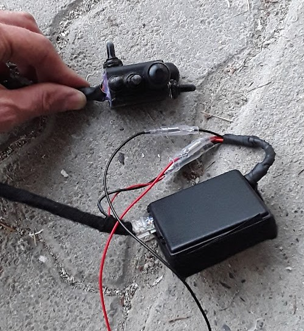
As 5V converter, an old cigarette lighter to USB converter was opened and used. If there is a problem,
please open a GitHub issue.

OsmAnd supports keyboard control, see [here](https://osmand.net/docs/user/map/interact-with-map/#external-input-device-buttons-android).

Rally Roadbook Reader supports audio buttons as remote control. Therefore, we just have to simulate a Bluetooth keyboard for both apps.

With a switch the user can selected if arrow keys for OsmAnd or audio keys for Rally Roadbook Reader are sent.

For other apps like [Drive Mode Dashboard 2](Drive Mode Dashboard 2) or Google Maps which don't support keys, one would had to create an Android app which uses
AccessibilityService or writes on a rooted device to "/dev/input/eventXX" to simulate touchscreen interactions on key presses.

For OsmAnd, seven buttons (4 arrow keys, 2 zoom keys, recenter location) and a switch (audio- oder arrow key mode) are needed. Such a switch can be bought e.g. from Aliexpress.

## Parts

| Part                                              | Price   | Link |
|---------------------------------------------------|---------|--|
| switch unit                                   | $ 16.60 | [https://www.aliexpress.com/item/1005002915264527.html](https://www.aliexpress.com/item/1005002915264527.html)  |
| ESP32 38 pins | $ 5.00  | [https://a.aliexpress.com/\_mLu2LNQ](https://a.aliexpress.com/_mLu2LNQ) |
| converter 5V                                      | $ 1.80  |  [https://a.aliexpress.com/\_m0LM53i](https://a.aliexpress.com/_m0LM53i) |
| case for ESP32 and converter 5V e.g. 80x38x22mm    | $ 1.50  | [https://a.aliexpress.com/\_m0X1o8g](https://a.aliexpress.com/_m0X1o8g) |
| ethernet cabel 2m                                  | $ 4.20  | [https://a.aliexpress.com/\_mKSXbrK](https://a.aliexpress.com/_mKSXbrK) |
| coupler RJ45 to connect ethernet cable            | $ 3.00  | [https://a.aliexpress.com/\_mPd2p1Q](https://a.aliexpress.com/_mPd2p1Q) |
| power cable with fuse and plug   | $ 3.80  | [https://www.aliexpress.com/item/4000920357198.html](https://www.aliexpress.com/item/4000920357198.html) |
| plug with cable to connect converter            | $ 2.70  | [https://www.aliexpress.com/item/1005004300282231.html](https://www.aliexpress.com/item/1005004300282231.html?) |
| fuse 1A medium                               | $ 1.20  | [https://a.aliexpress.com/\_mtDgORW](https://a.aliexpress.com/_mtDgORW) |
| shrinking tubes                                  | $ 3.00  | [https://a.aliexpress.com/\_mM2P9VA](https://a.aliexpress.com/_mM2P9VA) |
| insulating tape                                       |         |  |
| cable ties                                       |         |  |


### Additional parts for solder-free connections

| Part                                              | Price   | Link |
|---------------------------------------------------|---------|--|
| converter 5V with cable (instead converter above) | $ 3.50 | [https://a.aliexpress.com/\_m0lBVHO](https://a.aliexpress.com/_m0lBVHO)                                        |                                                                      |
| screwed connection adapter ESP32                          | $ 6.70 | [https://a.aliexpress.com/\_mMmdk12](https://a.aliexpress.com/_mMmdk12)                                        |                                                                      |
| heat shrink connectors                                  | $ 6.10 | [https://www.aliexpress.com/item/1005002538906794.html](https://www.aliexpress.com/item/1005002538906794.html) |                                                                      |
| case e.g. 125x80x32mm (instead case above)           | $ 3.00 | [https://a.aliexpress.com/\_m0X1o8g](https://a.aliexpress.com/_m0X1o8g)                                        | test if it still fits below seat                                  |
| T connector                                               | $ 2.00 | [https://www.aliexpress.com/item/1005001792678305.html](https://www.aliexpress.com/item/1005001792678305.html) | to get power e.g. from tail light |

## Configure ESP32

1. Install driver for USB/serial converter chip of the ESP32 board. Sometimes Windows installs the driver automatically. Else if it is an CP2102, see [here](https://www.silabs.com/developers/usb-to-uart-bridge-vcp-drivers?tab=downloads). If it is an CH9102X-Chip, see [here](https://arduino.stackexchange.com/q/88522).
 
2. Open device manager and check which COM port is used by the ESP32: 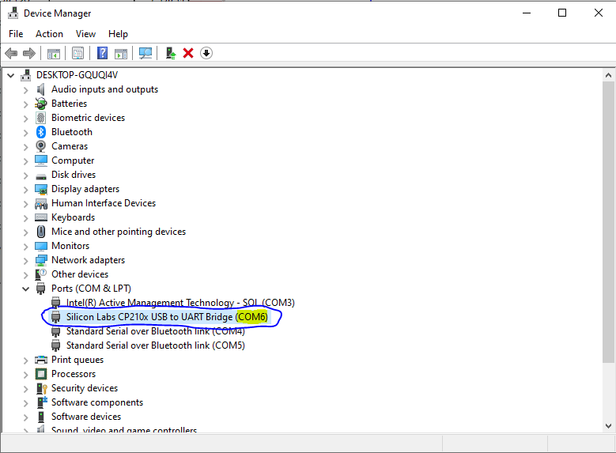
3. Install Arduino IDE: https://www.arduino.cc/en/software
4. Add ESP32 to Arduino IDE: open "File" - "Preferences"  and add `https://raw.githubusercontent.com/espressif/arduino-esp32/gh-pages/package_esp32_index.json` as URL: 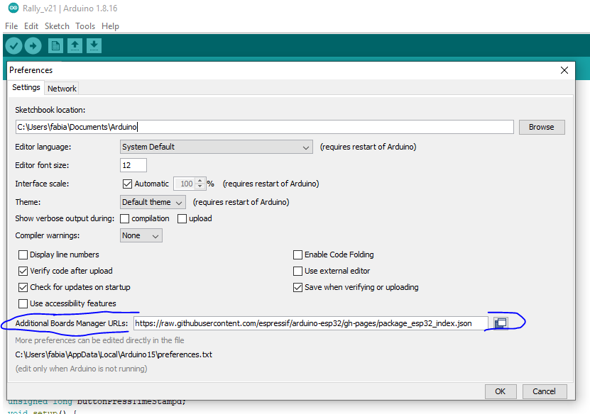
5. At "Tools" - "Board" select "ESP32 Dev Module": 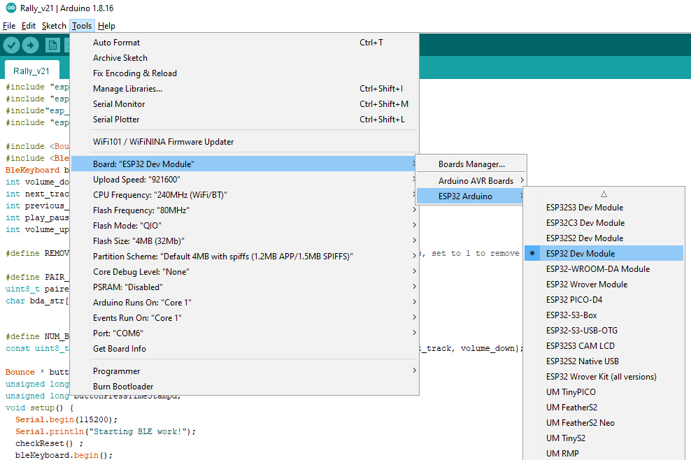
6. At "Tools" - "Port" selected the correct COM port from device manager: 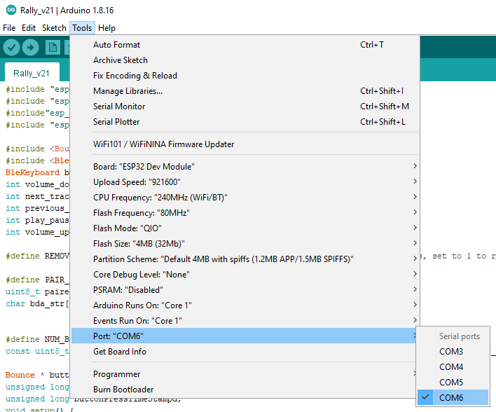
7. Install the BLE keyboard library: open [this link](https://github.com/T-vK/ESP32-BLE-Keyboard/releases), download "ESP32-BLE-Keyboard.zip" from "Assets" and open the ZIP file at "Sketch" -> "Include Library" -> "Add .ZIP Library...":<br />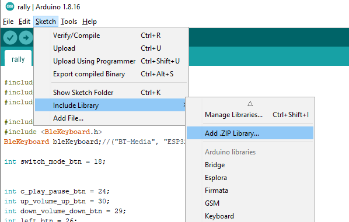
8. Install the der Bounce2 library: open "Tools" - "Manage Libraries...", search for "bounce2" and install it:  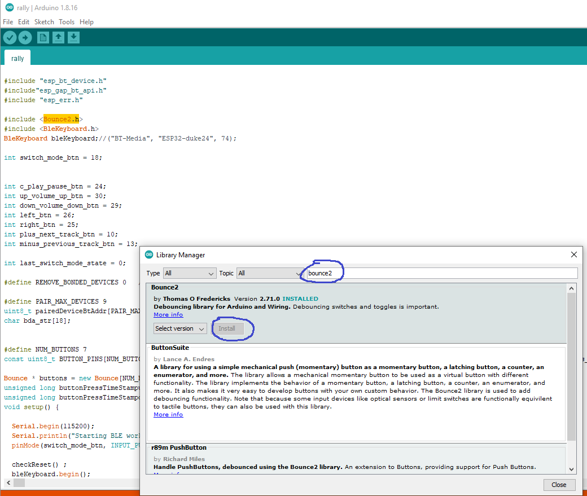
9. Copy the code from [rally.ino](./rally.ino) in the editor window and save it
10. Upload the code with the right arrow symbol: 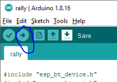
11. Open the serial console: 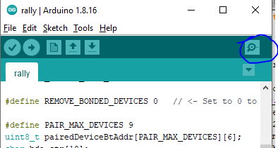
12. Select "115200 baud" as speed: 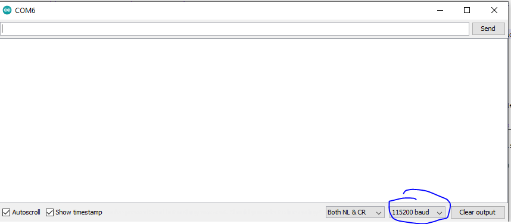. The console output should contain "Starting BLE work!", if not, disconnect ESP32, connect again and open the serial console
13. You should be able to connect now to the virtual Bluetooth keyboard with your phone/tablet

## Connect ESP32

A few connections needs to be soldered. If you don't have any experience with soldering, you can try to ask in the nearest [hackerspace](https://wiki.hackerspaces.org/List_of_Hacker_Spaces) how to do it or buy a screw connectr adapter (see table above).

One side of every button/switch must be connected to ground (–), the other side  to a pin of the ESP32. According to https://randomnerdtutorials.com/esp32-pinout-reference-gpios/, the pins 13-33 and 4, 5 are suitable for our purpose.

The ESP32 needs 3.3V, but has a built-in converter, The built-in converter converts higher voltage to heat and 3.3V. Therefore, more than 5V is not recommended. The input of the converter is the pin "VIN". VIN should not be connected directly to motor vehicle + because the voltage can sometimes be much higher than expected. Electronis for cars/motorcycles should be protected against this. Therefore, we use a car USB converter  to generate 5V.
Ground –) must be connected to one of the "GND" pins. The ground side od the buttons/switches, of the 5V converter and GND of ESP32 must all be connected to the motorcycle's ground, e.g. with a ring connector to the battery or frame.


1. Drill a hole big enough for the ethernet cable
2. Cut around 20cm of the ethernet cable, remove a few millimeters of the insulation and pull it through the hole into the case
3. Tin-coat the wires, and if the ESP32 has pins soldered, tin-coat the needed pins
4. Solder the wires to the pins. I recommend to use the brown or blue wire for ground. The other colours do not matterm, just use pins between 13-33 or 4 or 5, e.g. 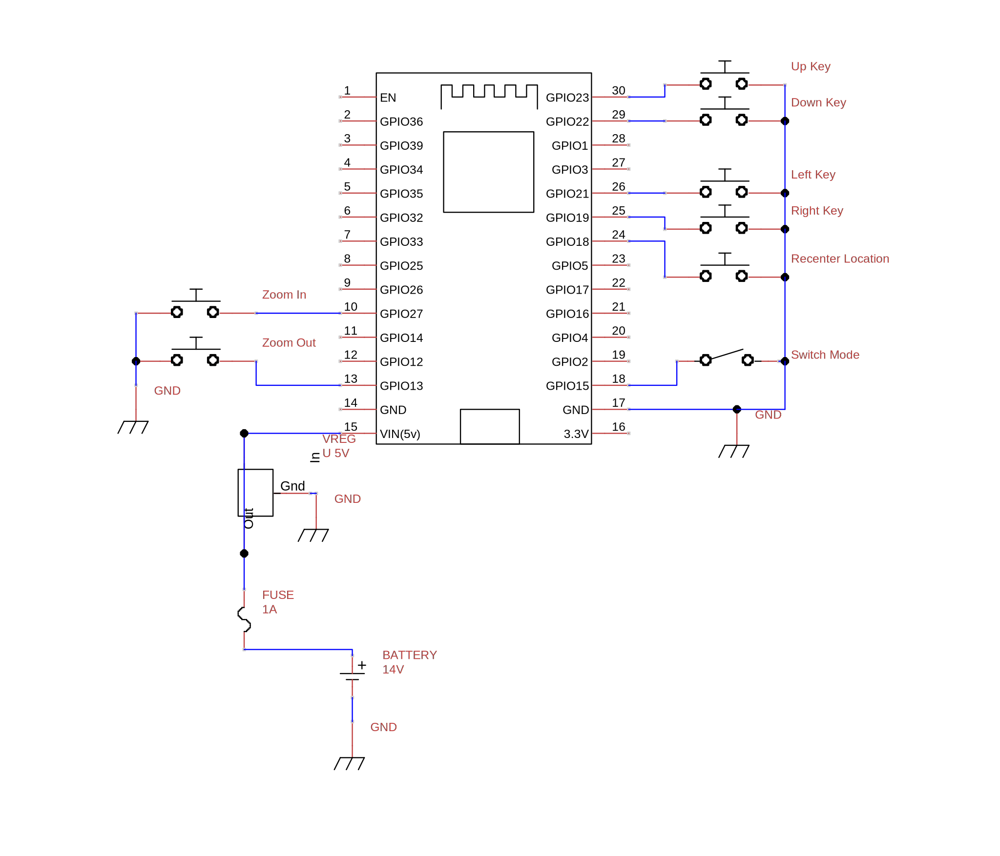
5. Shorten the other part of the ethernet cabel to the desired length and solder it to the switch unit. Heat shrinking connectors are very convenient for this.
6. In the Arduino code make sure the following lines contains pin numbers connected to the buttons/switches:
   ```C
   int switch_mode_btn = 18;

   int c_play_pause_btn = 24;
   int up_volume_up_btn = 30;
   int down_volume_down_btn = 29;
   int left_btn = 26;
   int right_btn = 25;
   int plus_next_track_btn = 10;
   int minus_previous_track_btn = 13;
   ```

7. Connect the buttons/switch with the RJ45 coupler, upload the code and open the serial console
8. Write down the current pin assocation in the code. Press every button/switch and write down the output, to correct the assocation in the code. When the switch is used, the messages will change a few time. That is no problem, the switch is not debounced because it is not necessary.
9. Correct the pin numbers in the code and upload it
10. Test the buttons/switch with OsmAnd und Rally Roadbook Reader
11. Remove USB cabel, then solder cables to 12V side of converter (drill a hole in case and pull it through). Connect to a 12V battery, check with a multimeter if the 5V pin is located like in this photo: <br /> 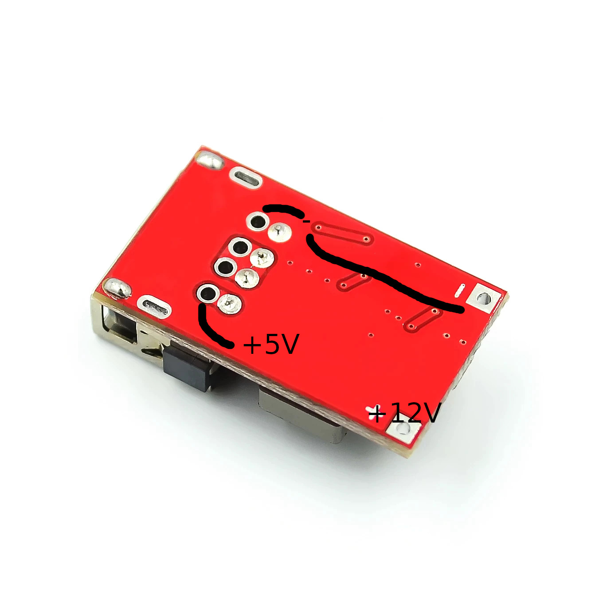
12. Solder the +5V side of the converter with some leftover cable to VIN of the ESP32
13. Solder – of the converter (– of 12 and 5V side is the same) to GND of ESP32. Ground side of the butoons/switch, GND of ESP32 and – of the converter must all be connected to ground of the motorcycle
14. Check if remote control of OsmAnd works with power from the 12V battery
15. Clean the ESP32 and converter with alcohol, optionally it can be coated with clear coat as moisture protection
15. Fix the ESP32 and converter with hot glue in the case. Fix also every cable with hot glue as protection against vibrations
16. Install the case and switch unit on the motorcycle. For switched +12V, the tail light cable can be used. No relay should be necessary because the ESP32 uses very little power and is fused by a 1A fuse. Either solder it to the +12V cable and insulte it properly or use a T connector. T connectors are not always reliable.
17. For ground use a screw connected to the frame or connect it to the battery
