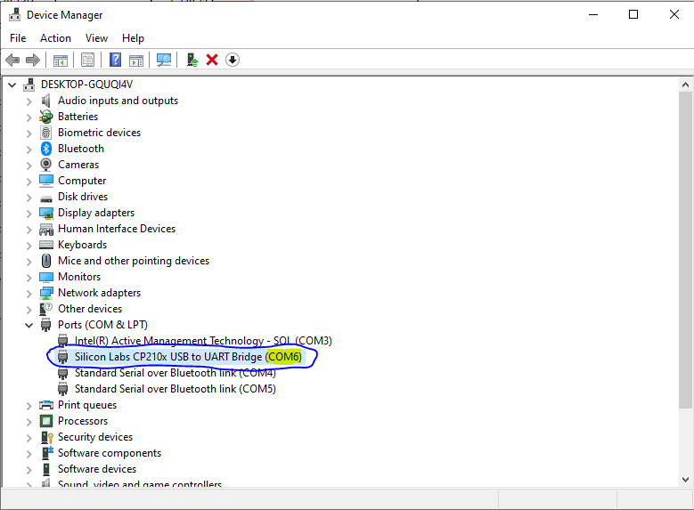
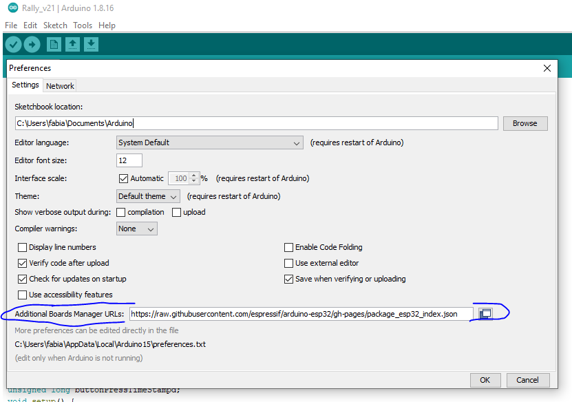
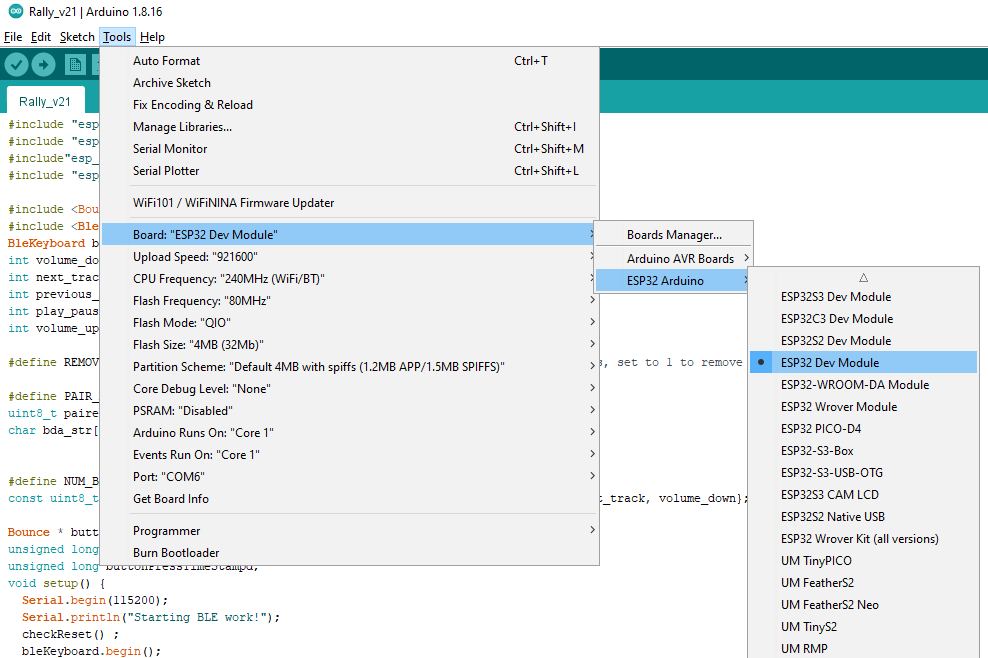
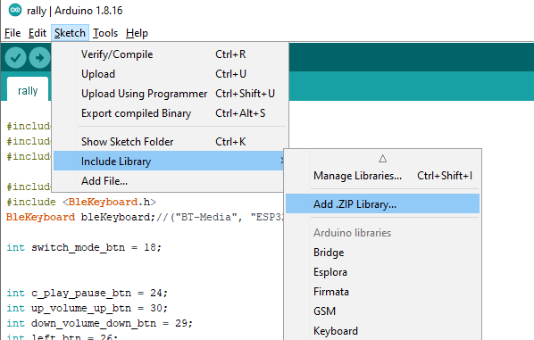
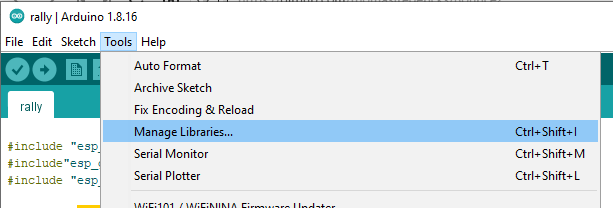
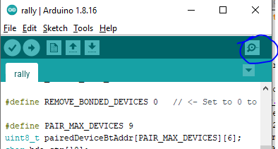
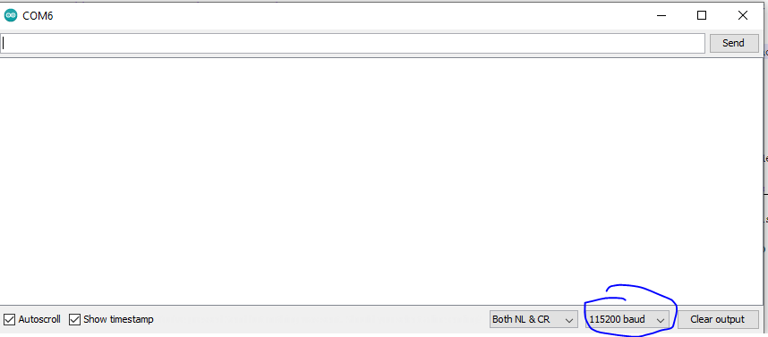
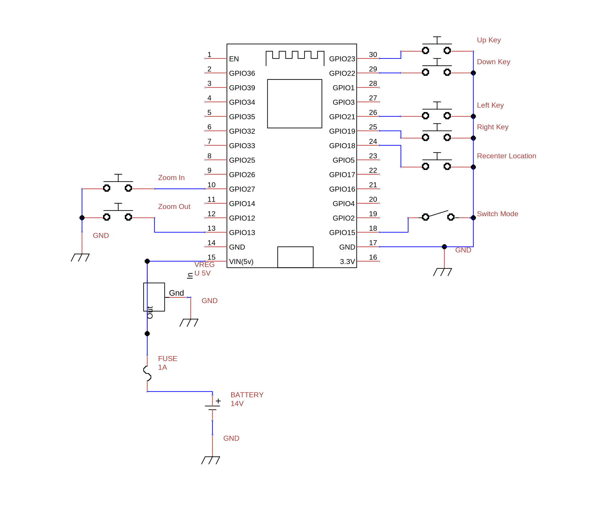
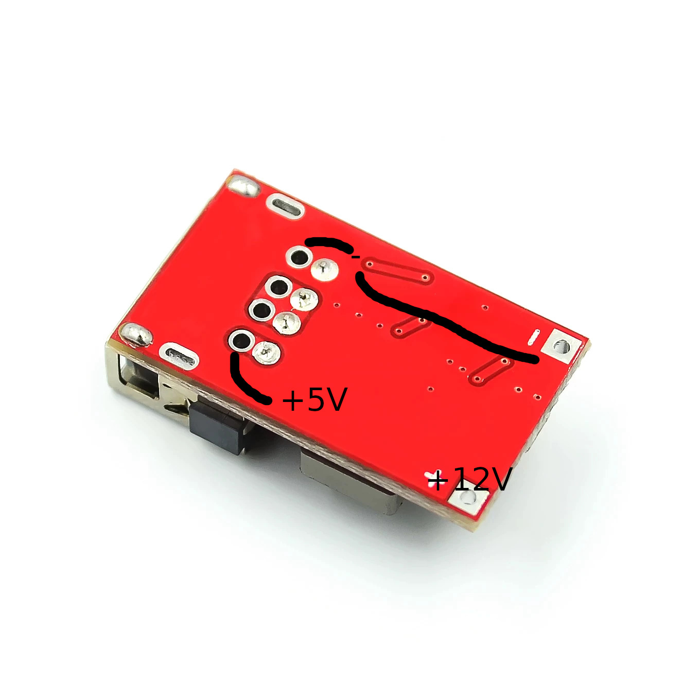

# Bauen einer Schaltereinheit zur Fernsteuerung von [OsmAnd](https://osmand.net) und [Rally Roadbook Reader](https://www.rallynavigator.com/rally-navigator-mobile-application)

## Einleitung

Diese Anleitung und der Code basiert auf dem Projekt von [NordicRally](https://www.instructables.com/Rally-Controller-With-Bluetooth/). Seine 3D-gedruckte Schaltereinheit wurde lediglich durche eine von Aliexpress ersetzen und der Code so angepasst, dass es sauber funktioniert.

Bei OsmAnd kann die Fernsteuerung per Tastatur aktiviert werden, siehe dazu [hier](https://osmand.net/docs/user/map/interact-with-map/#external-input-device-buttons-android).

Rally Roadbook Reader benutzt zur Navigation die Volumen- und Audio Vor-/Zurück-Knöpfe. Wir müssen also für beide Apps nur Tastendrücke wie von einer Bluetooth-Tastatur senden.

Per Schalter sollte man umstellen können, ob Pfeiltasten für OsmAnd oder Audio-Tasten für Rally Roadbook Reader gesendet werden. 

Man braucht sieben Taster (4 Pfeiltasten, 2 Zoomtasten, zentrieren) und einen Schalter (Audio- oder Pfeiltastenmodus). Eine solche Schaltereinheit gibt es bei z.B. bei Aliexpress.

## Benötigte Teile

| Teil                                              | Preis   | Link Aliexpress |
|---------------------------------------------------|---------|--|
| Schaltereinheit                                   | $ 16.60 | [https://www.aliexpress.com/item/1005002915264527.html](https://www.aliexpress.com/item/1005002915264527.html)  |
| ESP32 38 Pin, andere Versionen müssten auch gehen | $ 5.00  | [https://a.aliexpress.com/\_mLu2LNQ](https://a.aliexpress.com/_mLu2LNQ) |
| Konverter 5V                                      | $ 1.80  |  [https://a.aliexpress.com/\_m0LM53i](https://a.aliexpress.com/_m0LM53i) |
| Gehäuse ESP32 und Konverter 5V z.B. 80x38x22mm    | $ 1.50  | [https://a.aliexpress.com/\_m0X1o8g](https://a.aliexpress.com/_m0X1o8g) |
| Ethernetkabel 2m                                  | $ 4.20  | [https://a.aliexpress.com/\_mKSXbrK](https://a.aliexpress.com/_mKSXbrK) |
| Kopplung RJ45 Verbindung Ethernetkabel            | $ 3.00  | [https://a.aliexpress.com/\_mPd2p1Q](https://a.aliexpress.com/_mPd2p1Q) |
| Anschlusskabel mit Sicherungshalter und Stecker   | $ 3.80  | [https://www.aliexpress.com/item/4000920357198.html](https://www.aliexpress.com/item/4000920357198.html) |
| Stecker mit Kabel Anschluss Konverter             | $ 2.70  | [https://www.aliexpress.com/item/1005004300282231.html](https://www.aliexpress.com/item/1005004300282231.html?) |
| Sicherung 1A Medium                               | $ 1.20  | [https://a.aliexpress.com/\_mtDgORW](https://a.aliexpress.com/_mtDgORW) |
| Schrumpfschlauch                                  | $ 3.00  | [https://a.aliexpress.com/\_mM2P9VA](https://a.aliexpress.com/_mM2P9VA) |
| Isolierband                                       |         |  |
| Kabelbinder                                       |         |  |


### Zusätzliche Teile für lötfreie Verbindung

| Teil                                              | Preis   | Link Aliexpress |
|---------------------------------------------------|---------|--|
| Konverter 5V, nur Kabelanschluss (statt Konverter oben) | $ 3.50 | [https://a.aliexpress.com/\_m0lBVHO](https://a.aliexpress.com/_m0lBVHO)                                        |                                                                      |
| Schraubanschluss-Adapter ESP32                          | $ 6.70 | [https://a.aliexpress.com/\_mMmdk12](https://a.aliexpress.com/_mMmdk12)                                        |                                                                      |
| Heissluft-Lötverbinder                                  | $ 6.10 | [https://www.aliexpress.com/item/1005002538906794.html](https://www.aliexpress.com/item/1005002538906794.html) |                                                                      |
| Gehäuse z.B. 125x80x32mm (statt Gehäuse oben)           | $ 3.00 | [https://a.aliexpress.com/\_m0X1o8g](https://a.aliexpress.com/_m0X1o8g)                                        | prüfen, ob das unter Sitzbank passt                                  |
| Stromdieb                                               | $ 2.00 | [https://www.aliexpress.com/item/1005001792678305.html](https://www.aliexpress.com/item/1005001792678305.html) | Zur Abnahme z.B. von Rücklicht. Pfusch, aber Stromstärke sehr gering |

## Einrichten des ESP32

1. Richtige Treiber für USB-Serial-Konverterchip des jeweiligen ESP32-Boards installieren. Möglicherweise ist der Treiber in Windows bereits enthalten. Dann kann man direkt zu Schritt 2 gehen. Falls es einen CP2102 ist, siehe [hier](https://www.silabs.com/developers/usb-to-uart-bridge-vcp-drivers?tab=downloads). Falls es einen CH9102X-Chip ist, siehe [hier](https://www.rudolfschafing.de/2021/05/18/esp32-wifi-bluetooth-mit-arduino-ide/).
 
2. Gerätemanager öffnen und schauen, welcher COM-Port dem USB-Adapterchip zugeordnet ist: 
3. Arduino-IDE installieren: https://www.arduino.cc/en/software
4. Die ESP32 zu Arduino hinzufügen: "File" ("Datei") - "Preferences" ("Einstellungen") öffnen und `https://raw.githubusercontent.com/espressif/arduino-esp32/gh-pages/package_esp32_index.json` als URl einfügen: 
5. Unter Tools - Board hat bei mir "ESP32 Dev Module" funktioniert: 
6. Unter Tools - Port muss der im Gerätemanager gefundene Port eingestellt werden: 
7. Installieren der BLE Keyboard-Bibliothek: [hier](https://github.com/T-vK/ESP32-BLE-Keyboard/releases) beim ersten "Assets" "ESP32-BLE-Keyboard.zip" herunterladen und die ZIP-Datei unter  "Sketch" -> "Include Library" -> "Add .ZIP Library..." hinzufügen: 
8. Installieren der Bounce2-Biliothek: Unter "Tools" - "Manage Libraries..." nach "bounce2" suchen und installieren:  
9 Jetzt kopiert man den Code von [rally.ino](./rally.ino) in das Editorfenster und speichert das Projekt irgendwo
10. Und lädt ihn mit dem Symbol "Pfeil-nach-rechts" hoch: 
11. Man öffnet die serielle Konsole: 
12. Man stellt 115200 baud als Geschwindigkeit ein: . Der Output solle "Starting BLE work!" enthalten, falls nicht, ESP32 abstecken, neu einstecken und nochmals serielle Konsole öffnen
13. Man sollte jetzt bereits das gewünschte Handy-Tablet per Bluetooth verbinden können


## ESP32 anschliessen

Einige Anschlüsse müssen angelötet werden. Dazu sollte man einen temperaturgeregelten Lötkolben/Lötstation und gutes Lötzinn haben, am besten für Anfänger ist das in der EU/Schweiz seit kurzem verbotene bleihaltige Lötzinn (z.B. Pb 40% Sn 60% oder Pb 38% Sn 60% Cu 2%.). Für eine Anleitung siehe [hier](https://www.elektronik-kompendium.de/sites/grd/0705261.htm).

Wenn man keine Erfahrung mit löten hat, kann man sicher im nächsten [Hackerspace](https://wiki.hackerspaces.org/List_of_Hacker_Spaces) nachfragen oder man sich einen Schraubanschluss-Adapter wie [dieser](https://a.aliexpress.com/_mMmdk12).

Eine Seite jedes Schalters muss mit Masse (-) verbunden werden, die andere Seite mit je einem Pin des ESP32. Nach dieser https://randomnerdtutorials.com/esp32-pinout-reference-gpios/ Übersicht sind die Pins 13-33 sowie 4 und 5 geeignet. Wenn man hier etwas vertauscht, ist das nicht schlimm, man kann einfach im Code die Pinnummer ändern.

Der ESP32 braucht 3.3V, hat aber einen Konverter, der höhere Spannungen unter Wärmeverlust zu 3.3V umwandelt. Viel mehr als 5V ist deshalb längerfristig nicht gut. Der Eingang des Konverters ist der Pin "VIN". VIN sollte nicht an Kfz-Plus angeschlossen werden, da 13.5V viel Wärme erzeugt, die Spannung zu sehr schwankt und bei einem defekten Spannungsregler sogar Wechselstrom anliegen kann. Bei falschem Überbrücken kann auch Verpolung auftreten. Für Kfz bestimmte Elektronik ist im Normalfall dagegen abgesichert, weshalb ein USB-Konverter ideal ist, 5V zu generieren. 

Masse (-) ist am Pin "GND". Wenn mehrer "GND"-Pins da sind, sind sie intern miteinander verbunden. Die Masse der Schalter, des 5V-Konverters und GND vom ESP32 müssen alle mit der Fahrzeugmasse verbunden werden, z.B. über eine Ringöse an der Batterie oder am Rahmen.


1. Loch in Gehäuse bohren gerade gross genug für Ethernetkabel
2. Ca. 20 cm vom Ethernetkabel abschneiden, Ende entmanteln, die Litzen einige Millimeter abisolieren und durch Loch im Gehäuse führen
3. Litzen leicht verzinnen, wenn der ESP32 bereits Stifte hat diejenigen, die verwendet werden auch
4. Die verzinnten Litzen anlöten. Ich empfehle, "braun" für die Masse zu nehmen, der Rest ist egal, die Pins sollten aber wie oben erwähnt zwischen 13-33 sowie 4 und 5 sein, wie z.B. hier 
5. Der andere Teile des Ethernetkabels auf die gewünsche Länge kürzen und mit Schaltereinheit verlöten. Nicht vergessen, vorher einen Schrumpfschlauch darüberzuziehen, damit es gut aussieht. Statt Löten kann man auch einfach Heissluft-Lötverbinder nehmen.
6. Im Arduino-Code müssen auf den folgenden Zeilen Pins angegegeben sein, die auch verbunden wurden:
   ```C
   int switch_mode_btn = 18;

   int c_play_pause_btn = 24;
   int up_volume_up_btn = 30;
   int down_volume_down_btn = 29;
   int left_btn = 26;
   int right_btn = 25;
   int plus_next_track_btn = 10;
   int minus_previous_track_btn = 13;
   ```

7. Man verbindet jetzt per RJ45-Kupplung die Knöpfe, lädt den Code hoch und öffnet die Konsole
8. Man schreibt die aktuelle Zuordnung im Code auf und drückt jeden Taster/Schalter und schreibt sich zu jedem Druck die Ausgabe auf der Konsole aus, um die Zuordnung zu korrigieren. Beim Umlegen des Schalters wird die Meldung mehrmals wechseln, das ist normal, weil der nicht "debounced" ist. 
9. Im Code tauscht man jetzt die Pinnummern, damit die Zuordnungen stimmen und lädt ihn nochmals hoch
10. Jetzt sollten alles korrekt funktionieren, dazu auf dem Handy-Tablet mit OsmAnd und Rally Roadbook Reader Schalter und Taster testen
11. USB-Kabel abstecken, bei 5V-Konverter zuerst 12V-Kabel anlöten (vorher Loch in Gehäuse bohren und durchstecken) und mit 12V-Batterie verbinden. Mit Multimeter testen, ob der von mir vermutete 5V-Pin stimmt: <br /> 
12. Jetzt +5V vom Konverter mit etwas Litze z.B. von einem Reststück Ethernetkabel mit VIN des ESP32 verbinden
13. – vom Konverter (– vom Input und Output ist egal, da sowieso verbunden) mit ESP32 verbinden. Masse der Schalter, GND des ESP32 und - des Konverters und Masse des Fahrzeugs müssen verbunden sein
14. Testen, ob Fernsteuerung von OsmAnd mit Strom vom Fahrzeug funktioniert
15. Optional kann jetzt der ESP32 und Konverter mit Alkohol gereinigt und mit Klarlack versiegelt werden, damit bei eindringender Feuchtigkeit (unwahrscheinlich) nichts passiert
15. ESP32 und Konverter mit Heisskleber im Gehäuse gut fixieren. Mit Heisskleber auch alle Litzen und Kabel fixieren, damit sie vor Vibrationen geschützt sind.
16. Jetzt kann das Gehäuse und die Schaltereinheit am Motorrad installiert werden. Für geschaltetets +12V kann man das Rücklicht anzapfen. Normalerweise sollte man dabei immer ein Relais verwenden, da der ESP32 aber kaum Strom verbraucht und mit 1A abgesichert ist, halte ich das hier für überflüssig.
    Für das anzapfen schave ich etwas Isolierung mit einem Messer ab, halte den Lötkolben auf die Kupferlitzen und verzinne die Stelle. Dann kann man das ebenfalls verzinnte Anschlusskabel anlöten. Zur Zugsentlastung binde ich dann beide Kabel direkt danach mit einem Mini-Kabelbinder zusammen und isoliere
	die Stelle mit selbsverschweissendem Isolierband. Einen "Stromdieb" kann man wahrscheinlich auch verwenden, obwohl diese anscheinend nicht so zuverlässig sind.
17. Masse kann man direkt an der Schraube abgreifen, mit der die Airbox mit dem Rahmen verbunden ist


